# AgentBridge — Architecture Wiring Diagrams

[<kbd>English</kbd>](README.md) · [<kbd>العربية</kbd>](README.ar.md)

Maintainable Mermaid sources live in [`src/`](src/) and locally rendered SVGs (no external service) in [`svg/`](svg/). Every diagram distinguishes **IMPLEMENTED**, **PLANNED** (dashed), and failure paths; nothing is drawn that does not exist in the source tree.

## Legend

| Style | Meaning |
| --- | --- |
| Green fill | `IMPLEMENTED` — code exists in this repository and is covered by its automated tests |
| Orange fill | decision / gate / failure-path node |
| Red fill | hard failure outcome (run rejected) |
| Blue fill | data store or layer |
| Purple fill | LLM-backed agent node |
| Grey dashed | `PLANNED` — designed intent, `NOT_VERIFIED`, not implemented |
| Grey-blue fill | external actor/system outside the system boundary |
| Solid arrow | data or control flow · dotted arrow | guard, policy, or violation path |

## Diagram index

Rendered images are embedded below; sources are `src/<id>.mmd`.

| ID | Diagram | Status markers |
| --- | --- | --- |
| AB-DIAG-01 | System context | all IMPLEMENTED |
| AB-DIAG-02 | Workspaces and dependency directions | all IMPLEMENTED |
| AB-DIAG-03 | OpenAPI → certification pipeline | all IMPLEMENTED |
| AB-DIAG-04 | MCP request path | all IMPLEMENTED |
| AB-DIAG-05 | Agents, DAG, repair, HITL, signed snapshots | all IMPLEMENTED |
| AB-DIAG-06 | Memory layers L0–L4 | all IMPLEMENTED |
| AB-DIAG-07 | OIDC/OAuth/PKCE and workspace identity | all IMPLEMENTED |
| AB-DIAG-08 | Data isolation (RLS, Redis, pgvector) | all IMPLEMENTED |
| AB-DIAG-09 | Certificate issuance, signing, revocation | external KMS `PLANNED` |
| AB-DIAG-10 | Audit chain and tamper detection | all IMPLEMENTED |
| AB-DIAG-11 | Sandbox boundaries | general egress policy `PLANNED` |
| AB-DIAG-12 | Backup/restore, retention, deletion | external KMS backups `PLANNED` |
| AB-DIAG-13 | Data stores: Redis and pgvector | all IMPLEMENTED |
| AB-DIAG-14 | Static website vs. full platform | all IMPLEMENTED |

---

### AB-DIAG-01. System Context


- **Purpose & scope:** who interacts with AgentBridge and through which boundary; scope is the local evaluation deployment.
- **Trust boundaries:** browser ↔ API (tenant key, same-origin proxy); sandbox ↔ host; generated server ↔ upstream API.
- **Inputs → outputs:** OpenAPI spec + tenant key → certificate, badge, evidence, server package.
- **Sensitive data paths:** spec content (may contain PII) stays inside the pipeline; upstream credentials only as encrypted envelopes; tenant keys stored hashed.
- **Closed failure cases:** invalid tenant key → unified 401; sandbox network escape → `HARD_LIVE_PROBES_FAILED`.
- **Source proofs:** `apps/dashboard/`, `apps/api/src/routes/pipelines.route.ts`, `packages/orchestrator/src/engine.ts`, `infra/hardening/sandbox.ts`, `docs/security.md` §8.1.

### AB-DIAG-02. Workspaces and Dependency Directions


- **Purpose & scope:** pnpm workspace layout and the iron dependency rule (source points toward internal contracts; domain never imports infrastructure).
- **Trust boundaries:** package boundaries — `apps/` assemble, `packages/` implement, `shared` defines.
- **Inputs → outputs:** none (structural view).
- **Sensitive data paths:** none.
- **Closed failure cases:** lint/typecheck fail on any layering violation (`eslint.config.mjs`, per-package `tsc --noEmit`).
- **Source proofs:** `pnpm-workspace.yaml`, `docs/systems.md` (ownership table), per-package `package.json`.

### AB-DIAG-03. OpenAPI to Certification Pipeline


- **Purpose & scope:** the eight-stage deterministic DAG with the bounded repair loop and the HITL gate.
- **Trust boundaries:** spec content is untrusted data (injection scans); agent outputs are untrusted until Zod-validated.
- **Inputs → outputs:** spec → normalized spec → analyzed spec → tool designs → generated server → security report → certificate.
- **Sensitive data paths:** PII fields are detected and scored during analysis; payloads are redacted before audit storage.
- **Closed failure cases:** critical finding → instant reject; repair rounds exhausted → `needs_human`; invalid citations → repair; schema-invalid LLM output → structured failure.
- **Source proofs:** `packages/orchestrator/src/graph.ts`, `engine.ts`, `retry-policy.ts`, `packages/spec-parser/src/`, `packages/analyzer/src/`, `packages/generator/src/`, `packages/hardening/src/`, `packages/evaluator/src/citation-verifier.ts`, `docs/orchestration.md`.

### AB-DIAG-04. MCP Request Path


- **Purpose & scope:** one request from an AI agent through the generated server to the upstream API.
- **Trust boundaries:** agent input validated by zod schema per tool; upstream responses sanitized before returning.
- **Inputs → outputs:** JSON-RPC tool call → tool result or structured error.
- **Sensitive data paths:** upstream credentials come from environment only (`UPSTREAM_API_KEY` optional); upstream failure internals are never leaked to the agent (HD-02).
- **Closed failure cases:** invalid arguments rejected; missing scopes rejected; missing `UPSTREAM_BASE_URL` fails at boot; timeouts and error sanitization enforced.
- **Source proofs:** `packages/generator/src/templates/` (server, tools, upstream-client, config), `packages/hardening/src/live-probes.ts`.

### AB-DIAG-05. Agents, DAG, Repair, HITL, Signed Snapshots


- **Purpose & scope:** how deterministic nodes and LLM agents mix, how repair is bounded, and how suspension/resume stays trustworthy.
- **Trust boundaries:** agents propose; deterministic code disposes; snapshots are signed (SHA-256) and schema-checked field-by-field on resume.
- **Inputs → outputs:** pipeline context → node outcomes (`completed | failed(retryable) | failed(fatal) | needs_repair`).
- **Sensitive data paths:** agent prompts receive redacted, delimited spec blocks; every tool call is audited.
- **Closed failure cases:** repair cap (3) → `needs_human`; critical finding → fatal; snapshot signature mismatch → resume refused.
- **Source proofs:** `packages/orchestrator/src/engine.ts`, `context-store.ts`, `event-log.ts`, `packages/agents/src/`, `docs/agents.md`, `docs/orchestration.md`.

### AB-DIAG-06. Memory Layers L0–L4


- **Purpose & scope:** working/episodic/semantic/vector/flywheel memory with ports and swappable adapters.
- **Trust boundaries:** every store call takes `tenantId` (structural isolation); PII redacted before L1/L3; L3 stores embeddings only, never raw sensitive text.
- **Inputs → outputs:** run events → L1; durable entities → L2; lesson text → deterministic embedding → L3 index.
- **Sensitive data paths:** L2 is the single source of truth; a full run is rebuildable from L2 + archived L1 (phoenix tests).
- **Closed failure cases:** missing tenant scope in any query is prevented by construction; cross-run state survives via signed snapshots only.
- **Source proofs:** `packages/memory/src/` (episodic-store, semantic-store, vector-store, flywheel), `packages/infra/src/pgvector-store.ts`, `prisma-*` stores, `docs/memory.md`.

### AB-DIAG-07. OIDC/OAuth/PKCE and Workspace Identity


- **Purpose & scope:** enterprise SSO configuration and the login callback with local token verification.
- **Trust boundaries:** issuer/JWKS must be HTTPS (zod + HB-12); JWKS fetching is allowlisted, IP-pinned, redirect-free; IdP tokens are never persisted.
- **Inputs → outputs:** `id_token` → verified claims → short-lived internal bearer → opaque server-side session.
- **Sensitive data paths:** session ids stored hashed (SHA-256); `clientSecret` env-only; JWKS URL never exposed through the API.
- **Closed failure cases:** wrong issuer → 401 before any tenant logic (HD-08); non-HTTPS JWKS blocked; expired/oversized tokens rejected.
- **Source proofs:** `packages/infra/src/oidc-verifier.ts`, `packages/infra/src/sso-store.ts`, `apps/api/src/plugins/sso.plugin.ts`, `apps/api/src/routes/oidc.route.ts`, `docs/security.md` §8.1.

### AB-DIAG-08. Data Isolation (RLS, Redis, pgvector)


- **Purpose & scope:** tenant isolation across PostgreSQL (RLS), Redis (key prefix), and pgvector (composite key).
- **Trust boundaries:** application connects as a restricted role (`NOSUPERUSER`, `NOBYPASSRLS`); boot check fails closed on elevated roles or table ownership.
- **Inputs → outputs:** tenant-scoped queries only; `SET LOCAL app.tenant_id` inside each transaction.
- **Sensitive data paths:** vector rows keyed by `(tenant_id, run_id, id)`; Redis keys `tenant:run:*` with 7-day TTL.
- **Closed failure cases:** cross-tenant read → empty/denied by RLS; superuser or BYPASSRLS connection → boot rejection.
- **Source proofs:** `packages/infra/src/prisma-scope.ts`, `prisma-scope-hardening.ts`, `prisma-scope-role.ts`, `prisma-scope-tables.ts`, `docs/security.md` §8.

### AB-DIAG-09. Certificate Issuance, Signing, Revocation


- **Purpose & scope:** how a run becomes a signed, publicly verifiable certificate and how trust evolves (rotation, revocation).
- **Trust boundaries:** score gate (≥ 85, zero critical); Ed25519 signatures; public verify endpoint exposes a strict whitelist only.
- **Inputs → outputs:** artifacts fingerprint + security report → certificate + `AB-<16hex>` id + badge.
- **Sensitive data paths:** the verify endpoint returns only `{verificationId, finalScore, granted, issuedAt, artifactsHash}` — no tenant data.
- **Closed failure cases:** critical finding → auto-reject regardless of score; revoked key id → verification rejected; old-key signatures remain verifiable during the rotation window.
- **Source proofs:** `packages/evaluator/src/certificate.ts`, `certificate-signing.ts`, `badge.ts`, `apps/api/src/routes/certificate-revoke.route.ts`, `docs/security.md` §8.1. External KMS: `PLANNED`, `NOT_VERIFIED`.

### AB-DIAG-10. Audit Chain and Tamper Detection


- **Purpose & scope:** append-only, hash-chained audit log per tenant; any tampering is detectable at an exact position.
- **Trust boundaries:** `hash_n = SHA-256(hash_{n-1} + event_n)` anchored at GENESIS; per-tenant write queues prevent races.
- **Inputs → outputs:** pipeline events and gate decisions → chained entries; `verifyChain(tenantId)` rebuilds and validates.
- **Sensitive data paths:** payloads abstracted and redacted before storage.
- **Closed failure cases:** any historical edit breaks the chain and is reported at its exact position.
- **Source proofs:** `packages/infra/src/audit-chain.ts`, `docs/memory.md` (audit section).

### AB-DIAG-11. Sandbox Boundaries


- **Purpose & scope:** the restricted container that executes live checks against the generated server.
- **Trust boundaries:** read-only root filesystem, non-root user `65532`, cpu/memory/PID caps, seccomp default, no-new-privileges, network confined to localhost programmatically (`assertLocalhostOnly`).
- **Inputs → outputs:** generated server + probe plan → live check results or `HARD_LIVE_PROBES_FAILED`.
- **Sensitive data paths:** probes hit only local mocks; no external network from inside the container.
- **Closed failure cases:** root execution, filesystem writes, and external network attempts all fail (proven by `sandbox.spec.ts`).
- **Source proofs:** `infra/hardening/sandbox.ts`, `docker/sandbox.Dockerfile`, `docker-compose.sandbox.yaml`, `packages/hardening/src/live-probes.ts`, `mock-upstream.ts`, `mock-oidc-provider.ts`. General egress policy: `PLANNED`.

### AB-DIAG-12. Backup/Restore, Retention, Deletion


- **Purpose & scope:** data lifecycle end-to-end: retention per data class, verified backup/restore, and double deletion.
- **Trust boundaries:** retention policy is fail-closed in production (misconfiguration refuses boot); `auditLog` and `revocations` are permanent by policy.
- **Inputs → outputs:** `RETENTION_POLICY_JSON` → scheduled sweeps; workspace deletion → L2 row + L3 vector removed atomically.
- **Sensitive data paths:** backups contain operational data — restore is verified, and expiry follows the same policy.
- **Closed failure cases:** deleting a flywheel lesson removes both its L2 row and L3 index; audit entries survive deletion by policy.
- **Source proofs:** `.env.example` (`RETENTION_POLICY_JSON`), `apps/cli/src/ops/`, `packages/memory/src/deletion-operations.ts`, `packages/infra/src/audit-chain.ts`. External KMS-encrypted backups: `PLANNED`, `NOT_VERIFIED`.

### AB-DIAG-13. Data Stores: Redis and pgvector


- **Purpose & scope:** where operational and durable memory live — Redis for episodic run state and operational guards, PostgreSQL + pgvector for durable entities and embeddings — and how the same memory ports swap between in-memory and live adapters.
- **Trust boundaries:** every port call is tenant-scoped by construction; Redis keys carry tenant and run identifiers with a 7-day TTL renewed on write; vector rows never store raw sensitive text (embeddings only).
- **Inputs → outputs:** run events and resume points → Redis streams and state hashes; rate-limit, SSE-quota and budget-ledger counters → Redis keys; durable entities → L2 tables; lesson embeddings (1536-dim) → L3 pgvector index; flywheel lessons double-written to an L2 row plus an L3 index with atomic delete.
- **Sensitive data paths:** PII is redacted before episodic and vector storage; L2 is the single source of truth from which a run can be rebuilt (L1 is disposable, L3 is re-indexable).
- **Closed failure cases:** development mode needs no external services (in-memory adapters); live mode refuses boot when `DATABASE_URL`/`REDIS_URL` are missing; deleting a lesson removes both its L2 row and its L3 index.
- **Source proofs:** `packages/memory/src/` (episodic-store, semantic-store, vector-store, flywheel), `packages/infra/src/pgvector-store.ts`, `rate-limit-redis.ts`, `sse-quota-redis.ts`, `budget-redis-ledger.ts`, `run-lock.ts`, `packages/llm/src/embeddings-provider.ts`, `docs/memory.md`.

### AB-DIAG-14. Static Website vs. Full Platform


- **Purpose & scope:** what the static website under `website/` is and is not, compared with the full self-hosted platform.
- **Trust boundaries:** the static site is pre-built read-only content (no server runtime, no secrets, no forms, no tenant data); the platform boundary contains live services behind authentication and isolation.
- **Inputs → outputs:** visitor browser ← static pages (HTML/CSS/SVG) · platform user → authenticated dashboard → API → pipeline → certificate.
- **Sensitive data paths:** none on the static site; on the platform side, tenant keys are hashed and tenant data stays behind authenticated, tenant-scoped surfaces.
- **What the site does NOT run:** Fastify API, PostgreSQL/Redis/pgvector, the Docker sandbox, real sign-in, backend SSE, full MCP generation and checks, or any secret or user-data storage.
- **Closed failure cases:** the site cannot execute code or accept submissions (no forms, no trackers, no server-side runtime); the platform refuses unauthenticated access to tenant surfaces.
- **Source proofs:** `website/` (static pages), `apps/api/src/routes/`, `docker-compose.sandbox.yaml`, `docs/security.md` §8.1.
