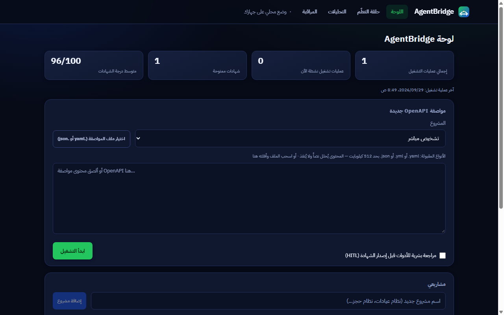
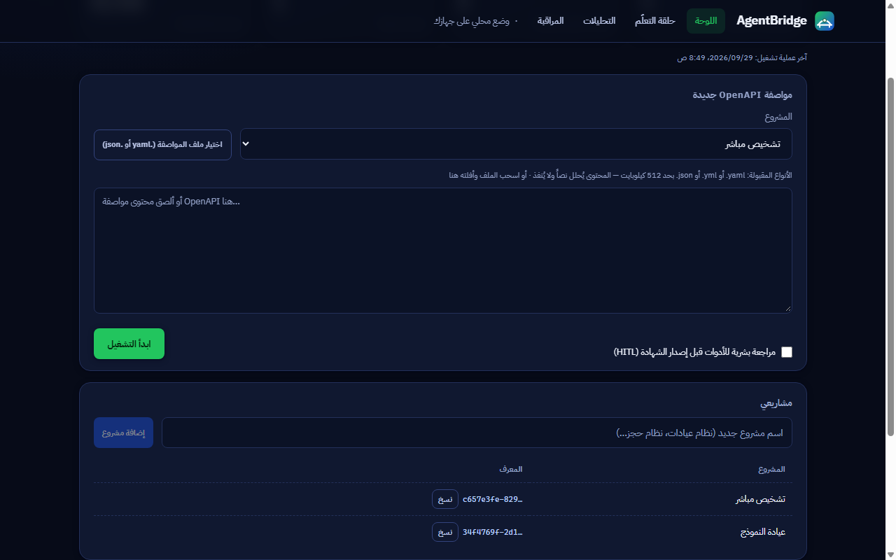
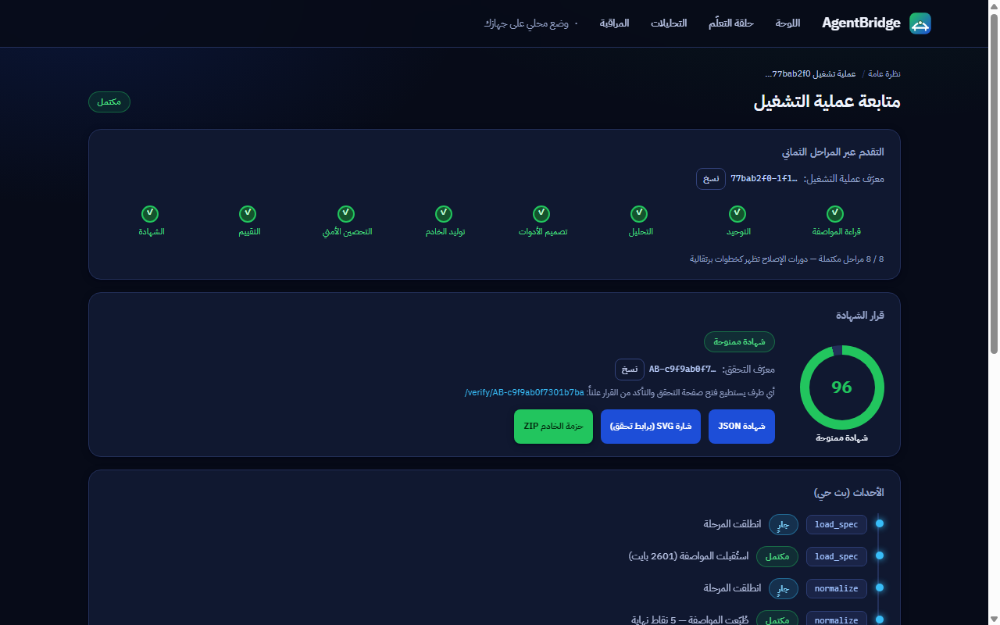
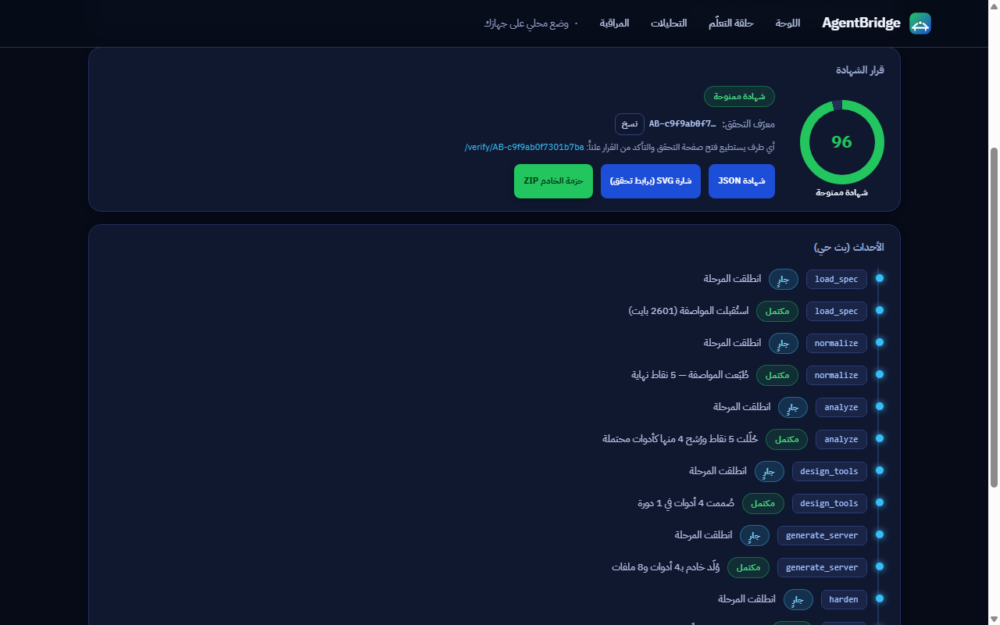
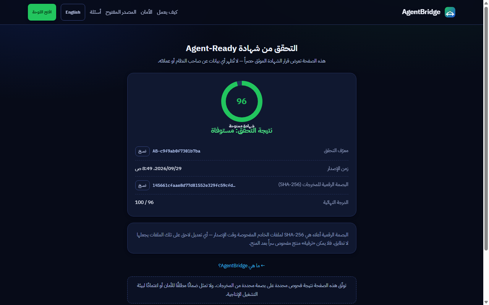

# دليل الاستخدام المصور — من OpenAPI إلى شهادة موقّعة

> لقطات حقيقية من المنصة تعمل محليًا بعد تثبيت كامل بـ`deploy/local` (انظر [دليل التثبيت المحلي](install-local.ar.md)). كل خطوة هنا قابلة للتكرار على تثبيتك.

## 1) الفتح المباشر بلا شاشة مفتاح

بعد `agentbridge start` افتح في متصفحك:

```
http://127.0.0.1:3411/app
```

فتح مباشر يكفي: اللوحة تؤسس الجلسة المحلية تلقائيًا — بلا معرّف مساحة عمل، وبلا مفتاح API، وبلا أي رمز في الرابط أو سجل المتصفح. وأمر `agentbridge open` يفعل الشيء نفسه ويشغّل الخدمات أولًا إن كانت متوقفة ثم يفتح المتصفح الافتراضي على هذا العنوان. المسار يعمل على `127.0.0.1` حصراً ومرتبط بجهازك؛ وبطاقة الدخول بمفتاح API تبقى للوضع متعدد المستخدمين/الشبكي حصراً.

## 2) لوحة التحكم

البطاقات العلوية تلخص الحالة: إجمالي عمليات التشغيل، النشطة الآن، الشهادات الممنوحة، ومتوسط الدرجات. النموذج «مواصفة OpenAPI جديدة» هو بداية الأنبوب: اختر مشروعًا، ثم ألصق مواصفة YAML/JSON أو ارفع ملفًا (حتى 512 كيلوبايت — يُحلَّل نصًا ولا يُنفَّذ).



## 3) رفع المواصفة

ألصق نص المواصفة في المربع (أو اسحب الملف). المثال هنا مواصفة `mini-petstore` التجريبية المرفقة في `tests/fixtures/` داخل المستودع.



## 4) التشغيل ومتابعة المراحل الثماني

زر «ابدأ التشغيل» ينشئ عملية تشغيل وينقلك لصفحتها: ثماني مراحل (قراءة، توحيد، تحليل، تصميم الأدوات، توليد الخادم، تحصين أمني، تقييم، شهادة) تُبث أحداثها حيًا — بما فيها فحوص التحصين الحية داخل حاوية معزولة (بلا شبكة، قراءة فقط، غير root).



## 5) القرار والأدلة

عند الاكتمال تظهر بطاقة القرار: الدرجة النهائية (العتبة 85 للمنح)، معرف تحقق عام `AB-…`، وأزرار تنزيل شهادة JSON وشارة SVG (برابط تحقق) وحزمة الخادم المولد ZIP. أدوات حساسة يمكن جعلها تنتظر موافقة بشرية قبل الشهادة عبر خيار HITL في النموذج.



## 6) التحقق العام

أي طرف — بلا حساب ولا دخول — يفتح `/verify/<معرف-التحقق>` ويرى قرار الشهادة الموثق حصراً: الدرجة، زمن الإصدار، وبصمة SHA-256 للأرتيفاكت المفحوص. أي تعديل لاحق على الملفات يجعل البصمة لا تطابق، فلا يمكن «ترقية» منتج مفحوص سراً بعد المنح.



## ملاحظات

- لقطات هذا الدليل من نسخة حقيقية تعمل محليًا؛ بيانات العرض (مشروع «عيادة النور» ومواصفة petstore) تجريبية.
- تسلسل الجيل حتمي: نفس المواصفة تعطي نفس بصمة الأرتيفاكت في كل تشغيل.
- جلسة الفتح المحلي لها مدة خمول وانتهاء مطلق كأي جلسة — انتهت؟ افتح `/app` من جديد فتؤسس تلقائيًا.
- مصادقة مفتاح API إلزامية لأي وصول برمجي — الوضع المحلي الاستثنائي الوحيد: جلسة تلقائية محروسة على `127.0.0.1` لحساب جهاز واحد (انظر security.md).
